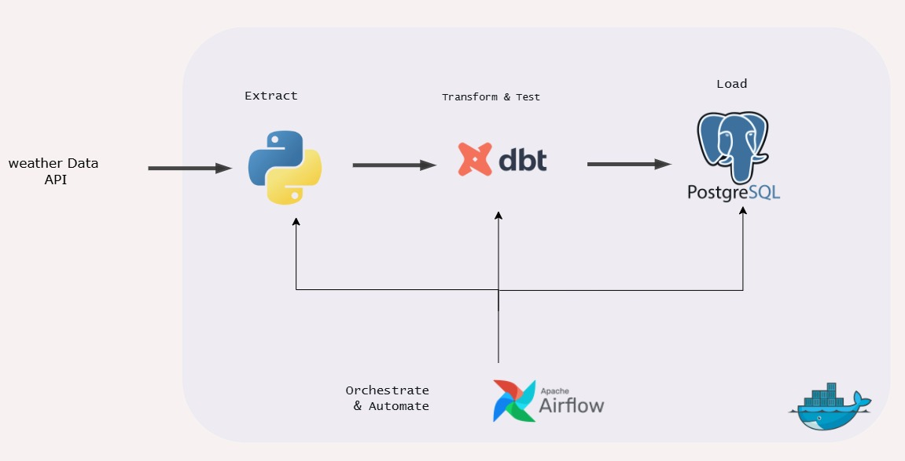
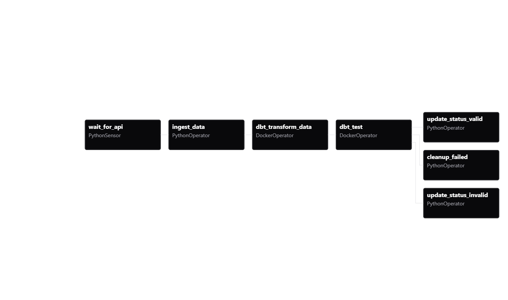
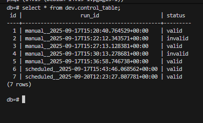
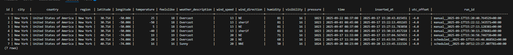
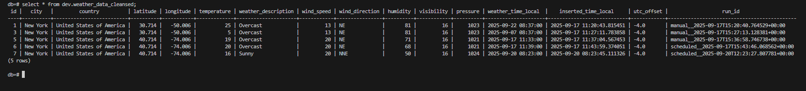

# Weather Data Pipeline

A robust, automated ETL pipeline that extracts weather data from the WeatherStack API, transforms it using dbt, and loads it into PostgreSQL. The entire pipeline is orchestrated with Apache Airflow and containerized with Docker.


## Table of Contents

- [Architecture Overview](#architecture-overview)
- [Technologies Used](#technologies-used)
- [Pipeline Workflow](#pipeline-workflow)
- [Project Structure](#project-structure)
- [Data Flow & Quality Management](#data-flow--quality-management)
- [Data Models](#data-models)
- [Database Schema & Results](#database-schema--results)
- [Data Quality Testing & Record Lifecycle](#data-quality-testing--record-lifecycle)
- [Key Features](#key-features)
- [Setup Instructions](#setup-instructions)


## Architecture Overview





## Technologies Used

- **🐍 Python**: Data extraction and API integration
- **🐘 PostgreSQL**: Primary data warehouse
- **🔄 dbt**: Data transformation and testing framework
- **🌊 Apache Airflow**: Workflow orchestration and scheduling
- **🐳 Docker**: Containerization and service management
- **📊 WeatherStack API**: Real-time weather data source

## Pipeline Workflow

### 1. Data Extraction
- **API Monitoring**: PythonSensor continuously monitors WeatherStack API availability
- **Data Fetching**: Retrieves real-time weather data for New York City
- **Data Ingestion**: Stores raw data in PostgreSQL with unique run IDs for tracking

### 2. Data Transformation (dbt)
- **Incremental Processing**: Efficiently handles new data using incremental materialization
- **Data Cleansing**: Removes duplicates and handles timezone conversions
- **Aggregations**: Creates city-level and country-level daily averages

### 3. Data Quality Testing
- **Schema Validation**: Ensures data types and constraints
- **Custom Tests**: Temperature range validation (-20°C to 80°C)
- **Reference Integrity**: Validates relationships between tables
- **Wind Direction Validation**: Ensures compass values are valid

### 4. Error Handling & Monitoring
- **Status Tracking**: Control table monitors pipeline run success/failure
- **Automatic Cleanup**: Failed runs trigger data cleanup procedures
- **Run Isolation**: Each pipeline run is tracked with unique identifiers

## Project Structure

```
weather-data-project/
├── api-request/
│   └── insert_record.py          # Data extraction and database operations
├── airflow/
│   └── dags/
│       └── orchestrator.py       # Main DAG definition
├── dbt/
│   ├── my_project/
│   │   ├── models/
│   │   │   ├── fact/
│   │   │   │   └── weather_data_cleansed.sql
│   │   │   ├── mart/
│   │   │   │   ├── city_avg_data.sql
│   │   │   │   └── country_avg.sql
│   │   │   └── sources/
│   │   │       ├── control_table.sql
│   │   │       └── schema.yml
│   │   ├── macros/
│   │   │   └── range_values.sql   # Custom test macro
│   │   └── dbt_project.yml
│   └── profiles.yml
├── postgres/
│   ├── data/                      # PostgreSQL data directory
│   └── airflow_init.sql          # Database initialization
├── docker-compose.yml
└── README.md
```

## Data Flow & Quality Management

### Data Storage Strategy

The pipeline implements a **dual-layer data storage approach** that ensures complete data traceability while maintaining quality standards:

#### 1. Raw Data Layer (`raw_weather_data`)
- **Purpose**: Stores ALL data extracted from the WeatherStack API
- **Data Quality**: Contains both valid AND invalid records
- **Retention**: Complete historical record of every API call
- **Usage**: Serves as the immutable source of truth for auditing and reprocessing

#### 2. Cleansed Data Layer (`weather_data_cleansed`)  
- **Purpose**: Contains ONLY validated, high-quality data
- **Data Quality**: Records that pass all dbt tests
- **Population**: Fed from `raw_weather_data` through transformation pipeline
- **Usage**: Source for analytics, reporting, and downstream data marts

### Data Quality Control Flow

```
API Data → raw_weather_data (ALL records stored)
                ↓
        dbt Transformation
                ↓
        dbt Quality Tests
                ↓
    PASS → weather_data_cleansed (valid data only)
    FAIL → control_table status = 'invalid' + cleanup
```

## Control Table: Complete Pipeline Tracking

The `control_table` provides comprehensive tracking for every single record processed through the pipeline:

### Status Lifecycle
```
1. Raw data inserted → control_table entry created with status='pending'
2. dbt transformation runs → data moved to weather_data_cleansed
3. dbt tests execute:
   ✅ Tests PASS → status updated to 'valid'
   ❌ Tests FAIL → status updated to 'invalid' + data cleanup
```

### Status Meanings
- **`pending`**: Record inserted but not yet processed through quality checks
- **`valid`**: Record passed all data quality tests and exists in cleansed table
- **`invalid`**: Record failed quality tests and was removed from cleansed table

### Complete Audit Trail
Every record can be traced through the entire pipeline:

```sql
-- View complete status for all records
SELECT 
    r.id,
    r.city,
    r.temperature,
    r.run_id,
    c.status,
    CASE 
        WHEN w.id IS NOT NULL THEN 'Present in cleansed table'
        ELSE 'Not in cleansed table'
    END as cleansed_status
FROM dev.raw_weather_data r
LEFT JOIN dev.control_table c ON r.id = c.id
LEFT JOIN dev.weather_data_cleansed w ON r.id = w.id
ORDER BY r.inserted_at DESC;
```

## Data Models

### Source Layer (`dev` schema)
- **raw_weather_data**: Raw API data - ALL records (valid + invalid)
- **control_table**: Pipeline run tracking and status management for every record

### Fact Layer  
- **weather_data_cleansed**: ONLY validated, high-quality data that passed all tests

### Mart Layer
- **city_avg_data**: Daily aggregated weather metrics by city (from validated data only)
- **country_avg**: Daily aggregated weather metrics by country (from validated data only)

## Database Schema & Results

### Raw Weather Data
```sql
raw_weather_data (
    id SERIAL PRIMARY KEY,
    city TEXT,
    country TEXT,
    region TEXT,
    latitude FLOAT,
    longitude FLOAT,
    temperature FLOAT,
    feelslike FLOAT,
    weather_description TEXT,
    wind_speed FLOAT,
    wind_direction TEXT,
    humidity FLOAT,
    visibility FLOAT,
    pressure FLOAT,
    time TIMESTAMP,
    inserted_at TIMESTAMP,
    utc_offset TEXT,
    run_id TEXT
)
```

### Control Table
```sql
control_table (
    id INTEGER,
    run_id TEXT,
    status TEXT  -- 'pending', 'valid', 'invalid'
)
```

## Pipeline Results After Multiple Runs

The following screenshots demonstrate the pipeline behavior after several execution runs, showing how data quality management works across all three tables:

### 1. Control Table - Pipeline Run Tracking
*Shows the status tracking for all processed records*



**Key Observations:**
- Each record has a unique ID and run_id combination
- Status values show the lifecycle: 'valid' for passed tests, 'invalid' for failed tests
- Complete audit trail of all pipeline executions

### 2. Raw Weather Data - Complete Data Storage  
*Contains ALL data extracted from the API, regardless of quality*



**Key Observations:**
- ALL records from API calls are preserved
- Contains both valid data (normal temperatures) and invalid data (e.g., temperature = -40°C)
- Every record tagged with run_id for traceability
- Serves as immutable source of truth for audit purposes

### 3. Weather Data Cleansed - Quality-Validated Data Only
*Contains ONLY records that passed all dbt quality tests*



**Key Observations:**
- ONLY valid records that passed temperature range tests (-20°C to 80°C)
- Invalid records (like temperature = -40°C) are automatically removed
- Clean, reliable dataset ready for analytics and reporting
- Maintains referential integrity with raw data through ID field

### Data Quality Validation in Action

The screenshots demonstrate the pipeline's quality control effectiveness:

1. **Raw Layer**: Record with temperature = -40°C is stored (preserving all data)
2. **Control Layer**: Same record marked as 'invalid' after failing temperature range test  
3. **Cleansed Layer**: Invalid record is excluded, ensuring only quality data for analytics

This multi-layered approach ensures **zero data loss** while maintaining **high data quality** for downstream analytics.


## Data Quality Testing

The pipeline implements comprehensive data quality checks:

### Built-in dbt Tests
- **Uniqueness**: Ensures no duplicate records per run
- **Not Null**: Validates required fields
- **Referential Integrity**: Maintains relationships between tables

### Custom Tests
- **Temperature Range**: Validates temperatures between -20°C and 80°C
- **Wind Direction**: Ensures valid compass directions (N, NE, E, SE, S, SW, W, NW, etc.)

### Test Execution
Tests run automatically after each transformation. Failed tests trigger:
1. Status update to 'invalid' in control table
2. Automatic cleanup of processed data
3. Pipeline failure notification


## Key Features

### Complete Data Lineage & Audit Trail
- **Raw Data Preservation**: Every API response stored permanently in `raw_weather_data`
- **Quality Tracking**: Control table maintains status for every single record
- **Run Isolation**: Each pipeline execution tracked with unique run IDs
- **Data Recovery**: Invalid data can be reprocessed from raw layer if business rules change


### Fault Tolerance & Data Quality
- **Never Lose Data**: Failed quality checks don't delete raw records
- **Selective Processing**: Only validated data used for analytics
- **Status Transparency**: Always know why records were accepted/rejected
- **Reprocessing Capability**: Can rebuild cleansed layer from raw data anytime


## Setup Instructions

### Prerequisites
- Docker and Docker Compose
- WeatherStack API key

### Installation

1. **Clone the repository**
```bash
git clone <repository-url>
cd weather-data-project
```

2. **Configure API Key**
Update the API key in `api-request/insert_record.py`:
```python
api_key = "your_weatherstack_api_key_here"
```

3. **Start the services**
```bash
docker-compose up -d
docker-compose exec db psql -U db_user -d db
```

4. **Access services**
- Airflow UI: http://localhost:8000
- PostgreSQL: localhost:5000

### Service Configuration

#### PostgreSQL
- **Host**: localhost:5000
- **Database**: db
- **User**: db_user
- **Password**: db_password

#### Airflow
- **Web UI**: http://localhost:8000
- **Schedule**: Every 10 minutes
- **DAG ID**: weather_api_orcherastrator


